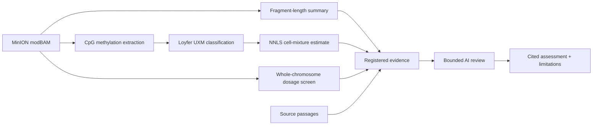

# Traceback

**One blood draw. Three computed cfDNA signals. Every claim traceable.**

Traceback turns Oxford Nanopore reads into fragment-length, methylation
cell-origin, and chromosome-dosage evidence, then uses a bounded AI reviewer
to check whether the written interpretation is actually supported.

[Open the live demo](https://cfddemo-production.up.railway.app) ·
[View the repository](https://github.com/danwiggins/cfddemo) ·
[Demo walkthrough](docs/DEMO.md) · [Algorithms](docs/ALGORITHMS.md)

> Research prototype only. It does not diagnose cancer or replace a validated
> clinical assay.

## What the demo proves

- **Fragmentomics:** a deterministic BAM-derived read-length distribution with
  explicit filters, denominator, mode, median, and long-fragment fraction.
- **Cell origin:** CpG methylation calls classified against Loyfer markers,
  followed by count-weighted NNLS deconvolution and seeded bootstrap intervals.
- **Chromosome dosage:** an experimental whole-chromosome screen using
  high-confidence read starts in fixed 5 Mb bins.
- **AI evidence review:** the model can select only registered checks and must
  cite the exact result or source passage behind its conclusion.
- **A real catch:** the reviewer identifies that the report's updated
  aligned-span method conflicts with its fixed 45 bp subtraction instructions.

The third readout is deliberately narrow: it is not ichorCNA, does not estimate
tumor fraction, and cannot resolve focal or subclonal events.



## Run locally

Requires Python 3.11 and [uv](https://docs.astral.sh/uv/).

```bash
uv sync
uv run pytest
uv run streamlit run app.py
```

To take one local BAM through the CLI (reference register, preflight, run,
verify, catalog import, `serve`), follow
[Real local BAM (unqualified)](docs/OPERATOR-GUIDE.md#real-local-bam-unqualified)
in the operator guide. It needs `samtools` (`brew install samtools`) to index
the inputs. Every record it makes is unqualified, local and not for clinical
use.

The checked-in public demo bundles contain aggregate measurements and
provenance only. They do not contain BAMs, read IDs, local paths, source
documents, or credentials.

### Review modes

- **Live:** the default local mode calls the Bedrock OpenAI-compatible Responses
  endpoint after the user presses **Run check**.
- **Recorded:** set `TRACEBACK_DEMO_REPLAY=1` to replay validated assessments
  without AWS credentials. The UI labels the result as a fixture and does not
  claim a live provider call.

For live review, configure the standard AWS credential chain and optionally:

| Variable | Default |
|---|---|
| `BEDROCK_MODEL_ID` | `openai.gpt-5.5` |
| `BEDROCK_REGION` | `us-east-2` |
| `BEDROCK_MAX_TOKENS` | `1024` |

## Regenerate cell-origin results

Private inputs belong under ignored `data/local/` paths:

- hg38 FASTA and minimap2 index
- Loyfer U250 regions, markers, atlas, and healthy-plasma reference workbook
- an aligned modBAM with valid `MM`, `ML`, and `MN` tags, or a normalized
  `modkit extract calls` TSV

```bash
TRACEBACK_FRAGMENT_HASH_SALT='local-private-value' \
  uv run python scripts/regenerate_cell_origin.py \
  --extract-tsv data/local/cell-origin/calls.normalized.tsv
```

The validated result is written to `data/local/cell-origin/result.json` and
takes precedence over the public aggregate bundle.

Regenerate the experimental chromosome-dosage result:

```bash
uv run python -m scripts.regenerate_copy_number \
  --bam data/local/cell-origin/full.hg38.sorted.bam
```

## Documentation

- [Three-minute demo](docs/DEMO.md)
- [75-second recording script](docs/RECORDING-SCRIPT.md)
- [Algorithm and evidence design](docs/ALGORITHMS.md)
- [Railway deployment](docs/DEPLOYMENT.md)

## Privacy boundary

Never commit `.env` files, credentials, sequence files, BAMs, read IDs, source
reports, local paths, or patient/sample identifiers. Tests are fully offline.
Only bounded excerpts and aggregate check results may enter model prompts.
